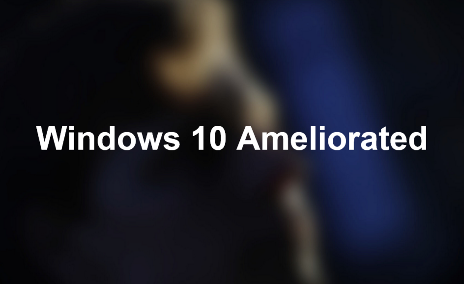

# **HELL INTERFACING ESSENTIAL SOFTWARE**

Here we fill out the software we use and recommend to other HELL INTERACING users (and possibly beyond). This list will attempt to strike a balance between proprietary software and free software, there's no favoritism at either end (but we absolutely despise abhorrently bloated software and stuff you have to jump through countless hoops in order to get working without sacrificing a child in the process to the FAGMAN overlords).

## **Operating Systems**

### *[Windows 8](https://www.microsoft.com/en-us/software-download/windows8ISO)*

Hot take, but once you strip Windows 8.1 out of its abhorrent design choices and remove all of the bloat, it's a great OS. EOL ends in 2023 so it's still going despite being on the brink of death. There's no lack of driver update issues like with Windows 7 in terms of modern devices and GPUs so it'd be great for gaymen. Only download official Windows 8.1 ISOs from the Microsoft site and then active with an activator of your choice (such as a clean version of KMS).

### *[Windows 10 (Modified)](https://www.microsoft.com/de-de/software-download/windows10)*

Underneath the TONS and TONS of Bill Gates turbo AIDS, there's a perfectly capable OS in here. You have to jump through quite a bit of hoops to get this thing clean for personal use, but once you do so, there isn't any debate - it's a good OS. Like earlier. Only download official ISOs from the Microsoft site instead of some Indian "Super Tech 64" Blogspot sites and activate with HWID. Note that in order to get the ISO download on the site instead of the Media Creation Tool, you'll have to change you're browser's User-Agent to either Linux or Mac OS. Next up you'll want to use something like Sycnex's [Windows10Debloater](https://github.com/Sycnex/Windows10Debloater) and run either the commandline PowerShell script or the GUI version.

### *[Windows 10 AME](https://ameliorated.info/)*

...alternatively you can instead get a version of Windows 10 named Ameliorated. This modified installer of Windows 10 removes a ton of the pre-installed bloatware, minimizes install time, eliminates things such as Windows Update and Cortana and removes many of the telemetry that Microsoft added. The changelist is massive and it is recommended to read up on AME yourself, or better yet, test drive it in a VM or a computer you might have lying around doing nothing.

### *GNU/Linux*

You knew this was coming. If you really, really love tinkering with your computer and want to immerse yourself in a new environment where knowledge of the inner workings of your OS and a lot of the installed software is incredibly useful, GNU/Linux might be for you. It's a vast world of [distributions](https://distrowatch.com/) which ranges from noob-friendly Windows replacements like [Linux Mint](https://linuxmint.com/) to l33t h4x0r + cunny-connoisseur distro like [Arch Linux](https://archlinux.org/). Speaking of Arch, appreciate the [ArchWiki](https://wiki.archlinux.org/) with all your power, because it is possibly one of the most comprehensive and well-maintained documentations in everything tech, going beyond just Arch but every aspect of GNU/Linux as well. Grab an ISO of whichever distro interests you and fire it up in a VM or install it on a Live USB and test drive it on your computer without having to install anything. Further info on GNU/Linux will be bellow.

## **Package Managers**
An advantage that has been enjoyed by Mac OS X and GNU/Linux users for years has been the concept of a package manager. Bluntly put, it's a piece of software that lets you connect to a central repository where other software is hosted and with it you can install applications within your commandline without the need to look for .exe's or any installer binaries yourself. A package manager can also batch update your installed software with a single command which is a selling point alone. The problem is that these repositories host mostly open-source software only and very rarely would you find closed-source, proprietary programs (but then again, you might be better off without them if there's a good open-source alternative instead).

### *[Chocolatey](https://chocolatey.org/)*

Choco is probably the largest package manager on Windows so far. It's super simple to install and figure out how to use it, especially if you have former package manager knowledge. On the website there is a ["search packages" function](https://community.chocolatey.org/packages) which will let you scour the entire repo and copy the install commands to paste into your commandline. The community is pretty large and the project seems to be in constant support, perhaps moreso than even Microsoft's own package manager winget.

### *winget*
In response to the surge in popularity that package managers have been receiving over the past couple of years, Microsoft responded with winget. It is included by default with Windows 11 and also available through Windows 10's 1709 version. It supposedly does what it says on the tin, but I personally have not used it and cannot speak for its quality especially compared to Chocolatey. Similarly to Choco's package repository search tool, there's also [winget.run](https://winget.run/) to browse the winget repo and conveniently copy commands.

## **Web Browsers**

### *[Firefox Nightly](https://www.mozilla.org/en-US/firefox/channel/desktop/)*

This is the beta channel of Mozilla Firefox, which I personally find to be (ironically enough) more stable than the stable channel. You do get quite a bit of "update available" notifications but it's definitely something you can disable in `about:config`. By now everyone should know what Firefox is, and despite Mozilla's [incomprehensibly dumb actions](https://blog.mozilla.org/en/mozilla/we-need-more-than-deplatforming/) over the recent years, this is still a fine browser that competes with the Chromium cancer that's infesting every other contemporary browser out right now. While it is factually slower in some use cases over Chrome or Edge, its extensibility and customization gives it a real advantage that you should consider when picking a browser.

### *[ungoogled-chromium](https://github.com/Eloston/ungoogled-chromium)*

ungoogled-chromium is a modification of Google Chromium which removes pretty much all of the features that phone back home to Google (even in normal Chromium). It does not allow the use of a Google account due to the stripped Google account integration. You might have to spend some time configuring its `chrome://settings` to your liking and enable things like saving cookies and site data upon closing of the browser, as such features are disabled by default for privacy reasons. Consult the [wiki](https://ungoogled-software.github.io/ungoogled-chromium-wiki/) for further information.

## **Utilities**
### *[Everything](https://www.voidtools.com/)*

Everything is an incredibly fast and lightweight file search engine for Windows which indexes your drive/s and monitors for changes to keep its index up to date. It also allows for Regex and advanced searches based on file metadata for extremely precise searches. It is recommended to exclude the Windows install folder by default as files within that directory could clog up your search results pretty often.

### *[7zip](https://www.7-zip.org/)*

7zip is a free and open source file archiver which can extract and pack compressed files like ZIP, 7Z, TAR, XZ, etc. It should be noted that RAR is only supported in a "read-only" mode, meaning that 7zip cannot create or modify RAR files. Still, 7Z as an archive format should be preferred due to its better compression and efficiency.

### *[HWiNFO](https://www.hwinfo.com/)*

HWiNFO is a Windows application which gives you extremely detailed information on your hardware and what it's currently doing. Think of Speccy, but on steroids. The program includes a sensor monitor which gives you a great view on every single aspect of your computer's hardware as well as a logger to monitor changes over time.

### *[QTTabBar](http://qttabbar.wikidot.com/)*
QTTabBar gives you more control over customizing the Windows File Explorer by enabling tabs and changing Explorer's behaviour like double-clicking on an empty space to have you go up a directory. It's small stuff, but once you're used to it, there's no going back.

## **Programming**
### *[Notepad++](https://notepad-plus-plus.org/)*
Notepad++ is a free/libre source code/text editor for Windows that is deeply customizable to fit your needs. It features syntax highlighting for dozens upon dozens of languages and also has [plugin support](https://github.com/notepad-plus-plus/nppPluginList) for all sorts of things such as a Markdown viewer and encryption/decryption.

### *[GNU Emacs](https://www.gnu.org/software/emacs/)*

GNU Emacs is an absurdly capable Lisp interpreter which goes beyond just being a simple text editor, but a self-contained "operating system", so to speak as well. It is highly extensible and customizable piece of software which is multiplatform and available to use anywhere, though ideally you'd want to use it on a GNU/Linux installation. org-mode is another very important component of GNU Emacs which serves as note-taking, checklisting, authoring, etc.

### *[vi/Vim](https://www.vim.org/)*

Speaking of configurable text editors, it's impossible to omit vi/Vim. With a very steep learning curve especially if you're not used to keyboard-centric editors, once you do get used to it you'll want those vi/Vim keybindings on any other editors, hence the dozens and dozens of keybind integrations in various editors and IDEs. Definitely not recommended for beginners who just want to modify a small config file or casually write text, but recommended to those who want to check out a touted editor.

### *[Visual Studio Code](https://code.visualstudio.com/)*

Somehow, Microsoft were able to make a genuinely great piece of software that's free and open source (and is also used to write this very document!). Despite being made using the abhorrent Electron framework, it somehow outperforms other software made with it, yet is still filled with tons of great features and good plugin library that's easy to access.